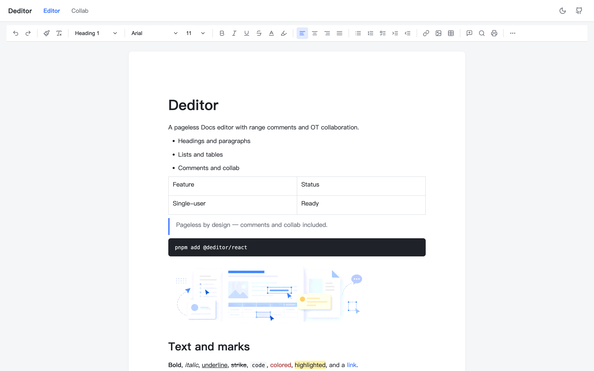
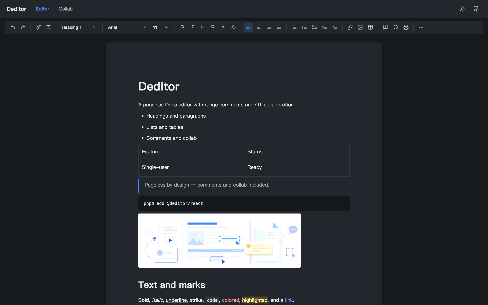

# Deditor

**Doc editor.** A TypeScript SDK for a pageless document editor built on [ProseMirror](https://prosemirror.net/). Range comments and operational-transform collaboration are first-class.

[Documentation](https://ximing.github.io/deditor/) · [Live demo](https://ximing.github.io/deditor/demo/) · [npm](https://www.npmjs.com/package/@deditor/react)

[](https://github.com/ximing/deditor/actions/workflows/ci.yml)
[](https://www.npmjs.com/package/@deditor/core)

## Preview

Pageless Docs chrome with a classic toolbar, document styles, and light / dark themes. Try the [live demo](https://ximing.github.io/deditor/demo/).





## Install

```bash
pnpm add @deditor/react @deditor/preset-docs @deditor/collab
```

Peer: `react` >= 18.

```ts
import { DocEditor } from '@deditor/react'
import '@deditor/react/style.css'

export function App() {
  return <DocEditor />
}
```

JSON is the document format. Quill Delta is not supported.

## Packages

| Package | Role |
| --- | --- |
| [`@deditor/core`](./packages/core) | Framework-agnostic `Editor`, schema merge, `CommentStore`, sanitizers, shared wire types |
| [`@deditor/preset-docs`](./packages/preset-docs) | Docs schema, commands, keymap, tables, lists, search, comment marks, document CSS |
| [`@deditor/collab`](./packages/collab) | OT via `prosemirror-collab` (not Yjs), comment FIFO, WebSocket provider |
| [`@deditor/react`](./packages/react) | `<DocEditor />` — toolbar, bubbles, find, comment sidebar |

`@deditor/react` depends on the other three. Collaboration is optional as a *feature*: omit the `collab` prop. Headless / Vue integrators skip `@deditor/react` and call `editor.mount` themselves.

## Collaboration

```ts
import { createWsProvider } from '@deditor/collab'
import { DocEditor } from '@deditor/react'

const provider = createWsProvider({
  url: 'wss://your-authority.example',
  roomId: 'doc-1',
  user: { id: 'u1', name: 'Ada', color: '#4f81bd' },
})

<DocEditor collab={provider} currentUser={{ id: 'u1', name: 'Ada', color: '#4f81bd' }} />
```

The sample `apps/collab-server` is an in-memory authority for demos. Do not ship it as production.

## Comments

Anchors are `comment` marks on the document. Bodies live in `CommentStore` and move as incremental `CommentOp`s. There is no suggestion mode.

## Workspace scripts

- `pnpm build` — build the four packages
- `pnpm test` — Vitest on packages
- `pnpm lint` — ESLint
- `pnpm dev:demo` — Vite playground at `/` and `/collab`
- `pnpm dev:collab` — in-memory WebSocket authority (not production)
- `pnpm dev:docs` — VitePress

## Publish

GitHub Actions publishes `@deditor/*` to npm on a version tag (`v0.6.0`, …). Repo secret `NPM_TOKEN` must be able to publish the `@deditor` org.

```bash
git tag v0.6.0
git push origin v0.6.0
```

## License

MIT
